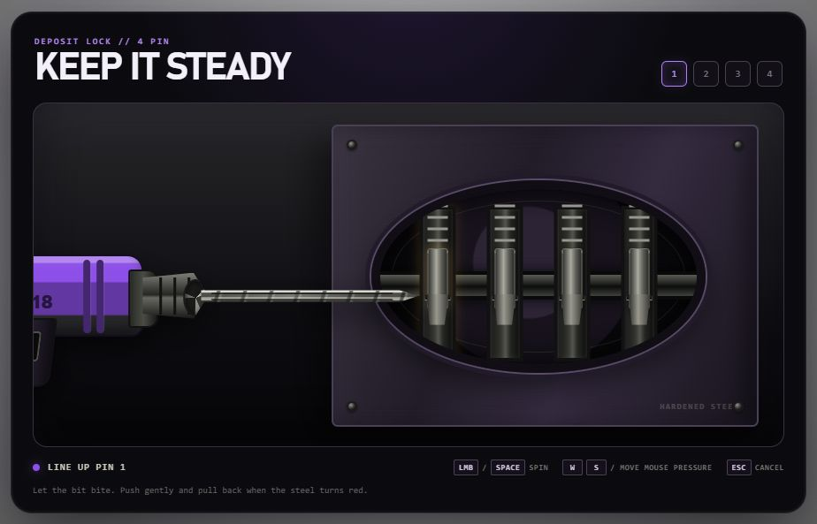
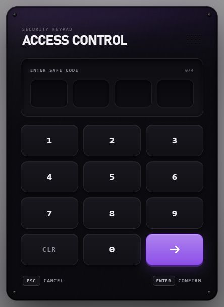
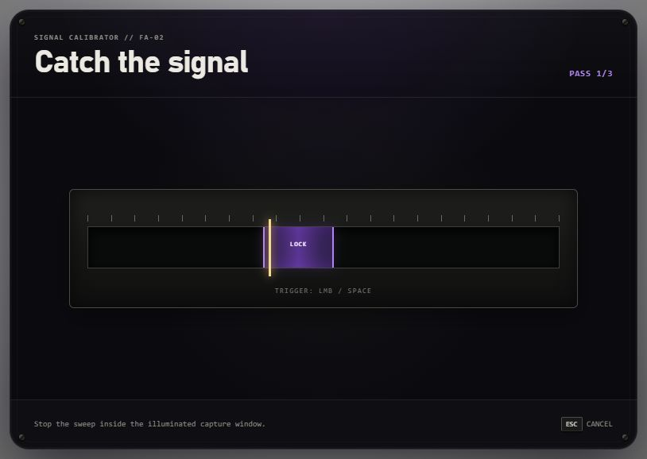
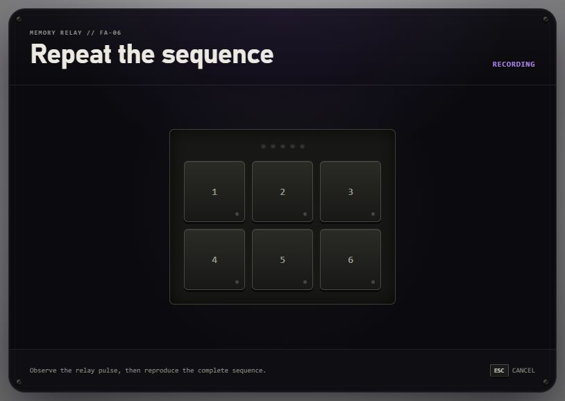
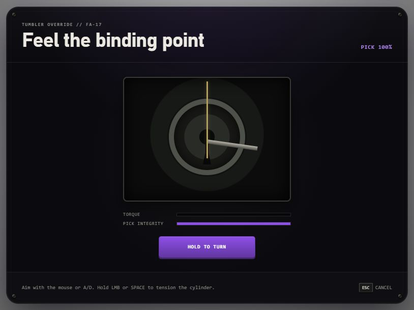
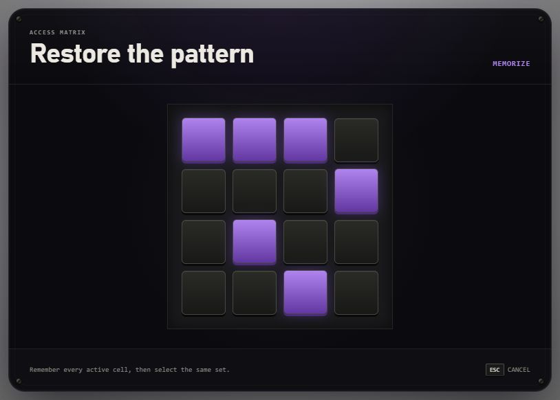
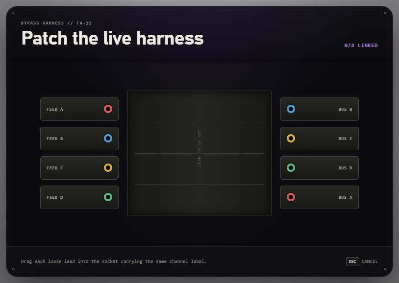
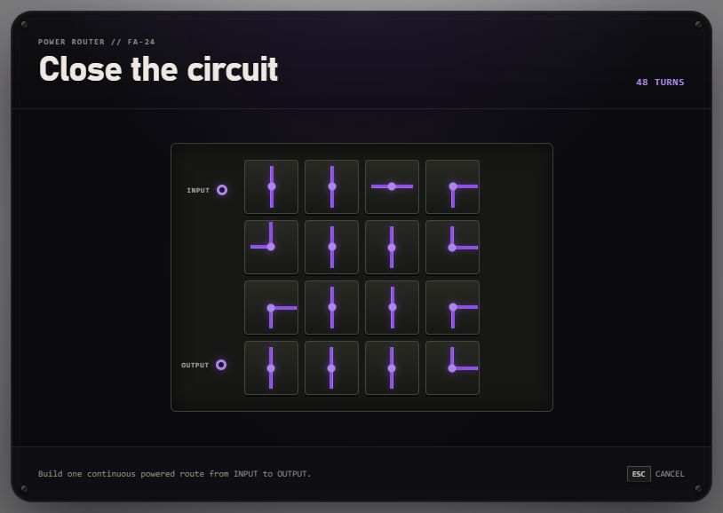
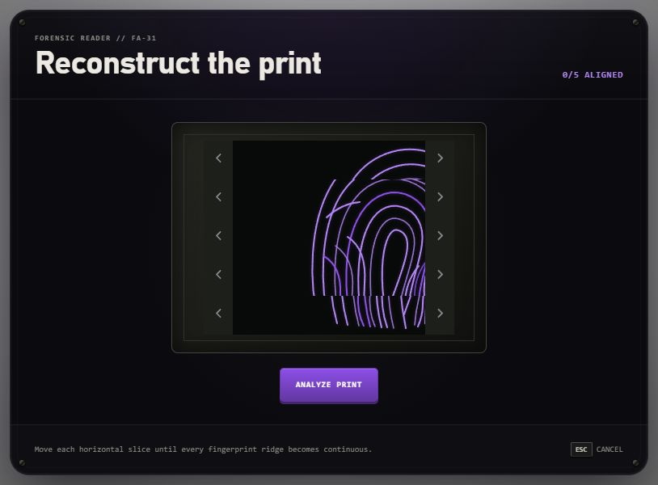
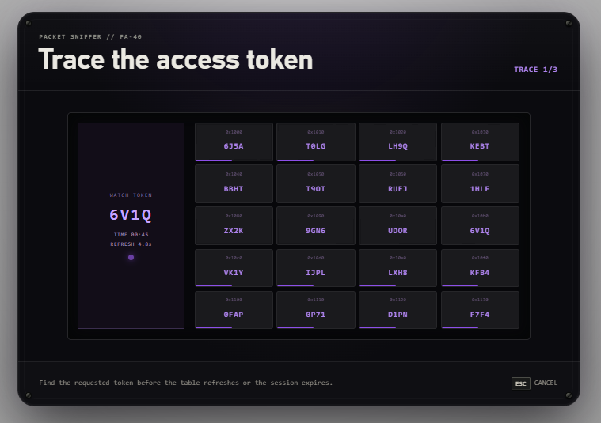

# FA Minigames

Free, framework-independent NUI minigames for FiveM. The resource exposes ten synchronous client exports and does not require a framework, inventory, database, or server-side dependency.

## Available games

| Export | Player objective |
| --- | --- |
| `Drill` | Balance pressure, drill speed, and heat to clear four pins. |
| `Keypad` | Enter and optionally validate a four-digit code. |
| `Skillbar` | Stop a moving marker inside the target area. |
| `Sequence` | Repeat the displayed button sequence. |
| `Lockpick` | Find the lock's binding angle and apply tension. |
| `Pattern` | Memorize and recreate a highlighted grid pattern. |
| `Wires` | Drag leads between matching labelled channels. |
| `Circuit` | Rotate tiles into one connected route. |
| `Fingerprint` | Align horizontal fingerprint slices. |
| `Terminal` | Find requested terminal tokens across multiple traces. |

## Preview

| Drill | Keypad |
| --- | --- |
|  |  |
| Skillbar | Sequence |
|  |  |
| Lockpick | Pattern |
|  |  |
| Wires | Circuit |
|  |  |
| Fingerprint | Terminal |
|  |  |

## Installation

1. Download a release or clone this repository into your server's resources directory.
2. Keep the folder name `fa_minigames`, or update every export call if you rename it.
3. Start it before resources that consume its exports.

```cfg
ensure fa_minigames
ensure your_resource
```

The release must include `web/dist/index.html` and `web/dist/assets`. Restart the server and verify one export in-game before integrating rewards or progression.

## Basic usage

Exports wait for the player to finish and return a result table to the calling client coroutine.

```lua
local result = exports.fa_minigames:Skillbar({
    difficulty = 3,
    rounds = 4,
    timeout = 30000
})

if result.success then
    -- Ask your server to validate and complete the owning action.
else
    print(('Minigame stopped: %s'):format(result.reason))
end
```

Only one session can run at a time. A concurrent call returns `reason = 'busy'`. Cancel the current session with `exports.fa_minigames:Cancel()`.

## Difficulty presets

Every game accepts `'easy'`, `'medium'`, or `'hard'`. Calling an export without arguments uses `medium`.

```lua
local result = exports.fa_minigames:Circuit('easy')
```

An options table can select a preset and override individual values:

```lua
local result = exports.fa_minigames:Terminal({
    difficulty = 'hard',
    refreshInterval = 10000,
    timeLimit = 60000
})
```

| Game | Easy | Medium | Hard |
| --- | --- | --- | --- |
| Drill | difficulty 1 | difficulty 2 | difficulty 4 |
| Keypad | 45 s | 30 s | 20 s |
| Skillbar | difficulty 1, 2 rounds | difficulty 3, 3 rounds | difficulty 5, 4 rounds |
| Sequence | 3 inputs, slower preview | 5 inputs | 7 inputs, faster preview |
| Lockpick | difficulty 1 | difficulty 3 | difficulty 5 |
| Pattern | 4 cells, 2.5 s preview | 6 cells, 1.8 s preview | 8 cells, 1.3 s preview |
| Wires | 3 channels | 4 channels | 5 channels |
| Circuit | 3 × 3 | 4 × 4 | 5 × 5 |
| Fingerprint | 3 slices | 5 slices | 7 slices |
| Terminal | 12 entries, 2 traces | 20 entries, 3 traces | 28 entries, 4 traces |

## Complete options reference

All time values are milliseconds. Numeric gameplay values are clamped in NUI to the documented ranges. The outer `timeout` has a minimum of 5000 ms.

Common options accepted by every options table:

| Option | Type | Default | Description |
| --- | --- | --- | --- |
| `difficulty` | preset string or supported number | `medium` | Selects a preset; numeric difficulty is supported by Drill, Skillbar, and Lockpick. |
| `timeout` | number | preset-specific | Maximum lifetime of the complete session. |
| `locale` | string | `Config.Locale` | Selects a table from `Locales`. |
| `theme` | table | `Config.Theme` | Per-call `main` and `accent` overrides. |

| Export | Game-specific options and safe ranges |
| --- | --- |
| `Drill` | `difficulty` 1–5, `timeout` |
| `Keypad` | `title` up to 32 characters, `timeout`, client-only `validate(code)` |
| `Skillbar` | `difficulty` 1–5, `rounds` 1–8, `timeout`, `compact` |
| `Sequence` | `length` 3–9, `previewInterval` 220–900, `timeout`, `compact` |
| `Lockpick` | `difficulty` 1–5, `timeout`, `compact` |
| `Pattern` | `length` 3–9, `previewDuration` 800–5000, `timeout`, `compact` |
| `Wires` | `channels` 3–5, `timeout` |
| `Circuit` | `size` 3–5, `timeout` |
| `Fingerprint` | `slices` 3–7, `timeout` |
| `Terminal` | `entries` 12–30, `rounds` 1–6, `refreshInterval` 1000–60000, `timeLimit` 5000–300000, `timeout` |

Terminal defaults to a 10-second table refresh, a 60-second internal time limit, and a 61-second outer timeout. Keep `timeout` slightly longer than `timeLimit` when overriding both.

## Theme configuration

Set global colours in `config.lua`. Values use the `#RRGGBB` format.

```lua
Config.Theme = {
    main = '#0B0B0F',
    accent = '#8D4FE8'
}
```

`main` controls the primary dark surfaces. `accent` controls actions, active states, highlights, traces, and scan graphics. The NUI derives additional shades and selects readable text for light or dark accents.

Override either colour for one call without rebuilding NUI:

```lua
local result = exports.fa_minigames:Skillbar({
    difficulty = 'medium',
    theme = {
        main = '#101820',
        accent = '#00B8D9'
    }
})
```

Invalid colours fall back to configured defaults. The visual system is designed around a dark `main` surface.

## Locales

Set the default locale in `config.lua` with `Config.Locale = 'en'`. Locale files live in `locales`. Copy `locales/en.lua`, change the table key, translate every value, and select it globally or per call.

```lua
Locales.pl = {
    cancel = 'ANULUJ',
    confirm = 'POTWIERDŹ',
    -- Copy and translate the remaining keys from locales/en.lua.
}

local result = exports.fa_minigames:Lockpick({ locale = 'pl' })
```

Placeholders such as `{round}`, `{rounds}`, `{pin}`, and `{durability}` must remain in translated strings. Missing entries use the English fallback embedded in NUI.

## Compact presentation

`Skillbar`, `Sequence`, `Lockpick`, and `Pattern` accept `compact = true`. Compact mode removes surrounding chrome and secondary information while preserving normal gameplay-control dimensions.

```lua
local result = exports.fa_minigames:Lockpick({
    difficulty = 'hard',
    compact = true,
    timeout = 25000
})
```

## Result contracts

`Skillbar`, `Sequence`, `Lockpick`, `Pattern`, `Wires`, `Circuit`, `Fingerprint`, and `Terminal` return:

```lua
{
    success = boolean,
    reason = 'completed' | 'failed' | 'cancelled' | 'timeout' | 'busy',
    data = table | nil
}
```

`data` contains diagnostic details such as completed rounds, remaining durability, aligned slices, or selected cells. It is not authoritative server state.

Drill returns `success` and `reason`:

```lua
local result = exports.fa_minigames:Drill('medium')
```

Without a validator, Keypad returns the submitted code plus `submitted`, `success`, `validated`, `reason`, and optional `message` fields.

```lua
local result = exports.fa_minigames:Keypad({
    title = 'Safe',
    timeout = 30000
})

if result.submitted then print(result.code) end
```

Never send the correct code to NUI. Validate it through the server owned by your consuming resource:

```lua
local result = exports.fa_minigames:Keypad({
    title = 'Safe',
    timeout = 30000,
    validate = function(code)
        local response = lib.callback.await('my_resource:validateCode', false, code)

        return {
            success = response.success == true,
            close = response.success == true,
            reason = response.success and 'completed' or 'failed',
            message = response.message
        }
    end
})
```

Returning `close = false` clears an invalid entry and keeps the keypad open.

## Security boundary

A successful client minigame is player input, not authority to grant rewards or complete protected state. The consuming server must validate:

- player permissions and role,
- distance and target identity,
- current gameplay state,
- attempts, cooldowns, and rate limits,
- required items and inventory capacity,
- rewards and every persistent change.

Keep correct keypad codes, reward values, webhooks, and secrets server-side.

## Troubleshooting

- **Export missing:** start `fa_minigames` before its consumer and use exact export casing.
- **NUI missing:** confirm `web/dist/index.html` and built assets are present, then inspect the first client-console error.
- **`busy` result:** wait for the active session or call `Cancel()` before starting a replacement.
- **Immediate close:** verify that `timeout` is in milliseconds; Terminal's outer timeout should exceed `timeLimit`.
- **Insecure reward:** move the owning decision to the server; a client success must not grant money, items, access, or progression.

Bug reports should include the version, FiveM artifact, game build, resource order, exact export call, reproduction steps, and first relevant error. Remove secrets from logs.

## Development

```powershell
cd web
npm.cmd install
npm.cmd run dev
npm.cmd run typecheck
npm.cmd run build
```

Use query parameters to open browser mocks:

```text
?game=terminal
?game=lockpick&compact=true
?game=keypad&main=101820&accent=00B8D9
```

Valid game names are `drill`, `keypad`, `skillbar`, `sequence`, `lockpick`, `pattern`, `wires`, `circuit`, `fingerprint`, and `terminal`. The browser keypad accepts `1234` as its preview success code.

Browser mocks and static builds do not prove NUI focus, FiveM callbacks, resource-stop cleanup, or live gameplay. Test changed interactions in FiveM before publishing a release.

## Contributing

See [CONTRIBUTING.md](CONTRIBUTING.md). Keep contributions focused, framework-independent, and compatible with the shared session/result contract.

## License

[MIT](LICENSE)
